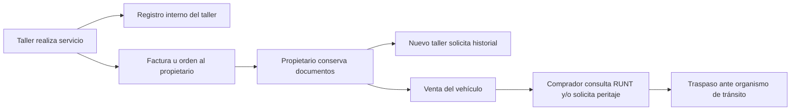
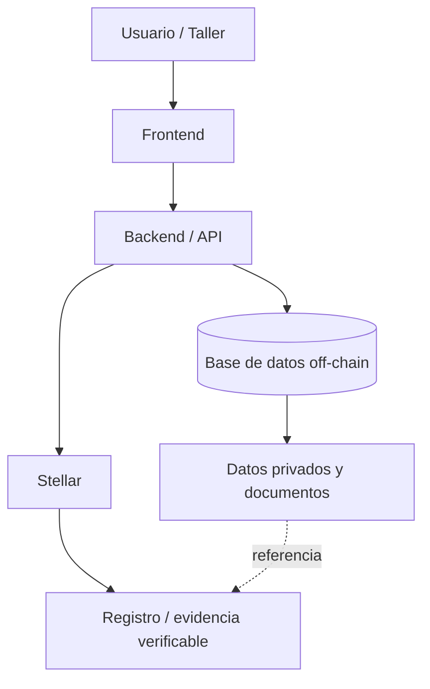

# VehicleChain: historial verificable de mantenimiento para vehículos

> Los propietarios de vehículos no tienen un historial único y verificable de los mantenimientos realizados en distintos talleres, lo que dificulta comprobar el mantenimiento real del vehículo cuando cambia de taller o de propietario.

**Programa:** Blockchain Builders 101  
**Fecha:** Septiembre 2026

---

# Parte 1: Selección del problema

## Problema elegido

Los propietarios de vehículos no cuentan con un historial único, completo y verificable de los mantenimientos y servicios realizados por diferentes talleres, lo que dificulta comprobar el mantenimiento real del vehículo cuando cambia de taller o de propietario.

**Propuesto por:** Lily.

## Por qué elegimos este

El equipo consideró que este problema tiene un impacto claro para propietarios, talleres y compradores de vehículos usados. El valor de la propuesta está en complementar la información oficial del vehículo con evidencia verificable de los mantenimientos realizados por diferentes talleres.

El problema también presenta una característica relevante para blockchain: varias partes independientes, con intereses diferentes y sin un administrador común aceptado por todos, necesitan consultar un mismo historial. Además, el valor del historial depende de poder demostrar que los registros realizados en el pasado no fueron modificados posteriormente.

La propuesta no depende inicialmente de que el Gobierno la haga obligatoria. Sin embargo, una eventual adopción institucional o integración futura con sistemas públicos podría ampliar su cobertura y convertirla en una infraestructura complementaria para el historial vehicular.

## Propuestas descartadas

**Dinero unificado para viajeros y migrantes** (propuesta por: _[nombre]_). Se descartó porque existen soluciones actuales que ya cubren buena parte del problema planteado, por lo que el espacio de diferenciación identificado por el equipo era más reducido.

**Identidad digital: problema y oportunidad** (propuesta por Alexis Suárez). Se descartó porque el equipo identificó alternativas tecnológicas existentes y porque no estaba suficientemente claro qué parte del problema requería blockchain frente a soluciones tradicionales de seguridad, identidad e interoperabilidad.

## Cómo tomamos la decisión

Por consenso. Cada integrante presentó su propuesta, el equipo debatió las ventajas y debilidades de cada una frente a los criterios de la Sesión 1 y se acordó avanzar con VehicleChain.

---

# Parte 2: Problem Brief

## Equipo y roles

| Integrante         | Usuario de GitHub | Rol                           |
| ------------------ | ----------------- | ----------------------------- |
| Lily               | Lilypar59         | Autora de la propuesta, admin |
| Alexis Suárez      | sualexiz          | writer                        |
| Juan Carlos Vargas | Ledger146         | writer                        |

**Responsable de las entregas:** Lily Pardo  
**Canal de coordinación interna:** _[WhatsApp ]_

---

## Problema y evidencia

### Enunciado

Los propietarios de vehículos no tienen un historial único y verificable de los mantenimientos realizados en distintos talleres, lo que dificulta comprobar el mantenimiento real del vehículo cuando cambia de taller o de propietario.

### Contexto, frecuencia y alcance

Un vehículo puede recibir servicios en diferentes talleres durante su vida útil. La información de esos servicios puede quedar distribuida entre facturas, órdenes de trabajo, fotografías, conversaciones digitales y sistemas internos de cada establecimiento. Cuando el propietario cambia de taller o decide vender el vehículo, reconstruir esa historia depende en gran medida de los documentos y registros que haya conservado.

El mercado de vehículos usados hace que esta situación sea relevante a escala nacional. En 2025 se realizaron cerca de 1,8 millones de traspasos de vehículos usados, según cifras citadas por La República a partir de información de actores del sector. Para enero-abril de 2026, Corferias reportó 334.767 traspasos con base en cifras de RUNT y Aconauto.

### Evidencia

El RUNT ofrece un Histórico Vehicular que permite consultar información como accidentes registrados, histórico de propietarios, SOAT y revisión técnico-mecánica. Esta herramienta demuestra que existe una necesidad real de consultar información histórica del vehículo, pero también delimita el espacio de VehicleChain: la propuesta no pretende reemplazar el RUNT, sino complementar el historial oficial con registros de mantenimiento realizados por talleres.

Además, un artículo de El Espectador publicado en junio de 2026 reportó, citando a la SIC, que cerca del 30 % de los vehículos usados en el mercado colombiano presentan algún tipo de inconsistencia en su historial, siendo la manipulación del kilometraje una de las más frecuentes.

> **Nota de validación:** antes de la entrega final, el equipo debe conservar las fuentes originales y verificar que cada cifra citada corresponda exactamente a la población y período que describe.

---

## Usuario y actores

### Usuario principal

El usuario principal es el propietario de un automóvil, motocicleta u otro vehículo que realiza mantenimientos en diferentes talleres. Necesita conservar y demostrar el historial de servicios realizados y poder consultarlo cuando cambia de taller o decide vender el vehículo.

### Cómo lo resuelve hoy y qué le cuesta

Actualmente puede conservar facturas, órdenes de trabajo, fotografías y conversaciones con los talleres, o depender de que cada taller mantenga sus propios registros. Esto genera esfuerzo para organizar y recuperar información y puede dificultar la verificación del mantenimiento ante un nuevo taller o un comprador.

### Actores principales del MVP

| Actor                       | Necesidad                              | Acción                     |
| --------------------------- | -------------------------------------- | -------------------------- |
| Propietario                 | Conservar y demostrar el historial     | Consulta y autoriza acceso |
| Taller                      | Dejar evidencia del servicio realizado | Registra el mantenimiento  |
| Comprador/nuevo propietario | Conocer el historial antes de comprar  | Consulta y verifica        |

### Actores futuros

| Actor                       | Posible participación futura                                           |
| --------------------------- | ---------------------------------------------------------------------- |
| Peritos                     | Usar el historial como evidencia complementaria durante una inspección |
| Aseguradoras                | Analizar información agregada y autorizada para estudios de riesgo     |
| Entidades públicas          | Integrar o consultar información bajo un marco institucional           |
| RUNT/organismos de tránsito | Posible interoperabilidad futura                                       |
| Fabricantes/concesionarios  | Incorporar servicios realizados dentro de redes autorizadas            |

---

## Flujo actual de valor

El activo principal que se mueve es la **información de mantenimiento del vehículo**.



### Secuencia

1. El propietario lleva el vehículo a un taller.
2. El taller realiza el servicio y registra información como fecha, kilometraje y trabajo realizado.
3. El taller entrega factura, orden de trabajo u otro comprobante.
4. El propietario conserva los documentos o registros digitales.
5. Si cambia de taller, debe aportar la información que haya conservado.
6. Si vende el vehículo, el comprador puede revisar la información oficial disponible y solicitar una inspección o peritaje.
7. El traspaso de propiedad se realiza mediante el procedimiento establecido por los organismos de tránsito.
8. La continuidad del historial de mantenimiento depende de que los documentos y registros anteriores permanezcan disponibles.

---

## Fricciones identificadas

### F1. Información aislada

Cada taller puede conservar la información en su propio sistema o mediante documentos físicos/digitales. No existe necesariamente un registro común de mantenimiento entre talleres independientes.

### F2. Pérdida de comprobantes

El historial puede depender de documentos que se pierden, conversaciones que se eliminan o establecimientos que dejan de operar.

### F3. Falta de contexto para un nuevo taller

Cuando el vehículo llega a un nuevo taller, puede ser difícil conocer qué servicios se realizaron anteriormente y cuándo.

### F4. Historial difícil de verificar durante una venta

El comprador depende de la información que pueda obtener del vendedor y de las verificaciones adicionales que decida realizar. Un historial incompleto dificulta distinguir entre un vehículo bien mantenido y uno cuyo historial presenta inconsistencias.

### F5. Costo de verificación

Cuando la información disponible no es suficiente, el comprador puede recurrir a inspecciones y peritajes adicionales.

### F6. El historial de mantenimiento no acompaña formalmente al vehículo

El cambio de propietario no implica necesariamente la transferencia estructurada de todos los registros de mantenimiento realizados en diferentes talleres.

---

## Oportunidad e hipótesis

### Oportunidad priorizada

La oportunidad priorizada es facilitar un **historial de mantenimiento verificable durante la compra o transferencia de un vehículo**.

Esta oportunidad concentra varias fricciones: si el historial se registra de manera estructurada y verificable, puede reducir la dependencia de documentos dispersos, facilitar la continuidad de la información y proporcionar evidencia adicional al comprador.

### Hipótesis

Creemos que un registro compartido en el que los talleres participantes registren los servicios realizados, junto con datos como fecha y kilometraje, y cuya evidencia posterior de modificación sea detectable, puede mejorar la confianza sobre el historial de mantenimiento del vehículo.

El comprador podría consultar el historial mediante una interfaz web y verificar la secuencia de registros. El propietario podría conservar una evidencia del mantenimiento aunque pierda sus comprobantes físicos. Un nuevo taller podría consultar el historial autorizado para conocer servicios anteriores.

### Caso de uso principal del MVP

**Comprar un vehículo usado y verificar su historial de mantenimiento.**

```text
Comprador
   |
   | consulta vehículo
   v
VehicleChain
   |
   | recupera historial verificable
   v
+--------------------------------+
| 2024 | Mantenimiento | 45.000 km |
| 2025 | Frenos        | 58.000 km |
| 2026 | Servicio      | 67.000 km |
+--------------------------------+
   |
   v
Verificación de consistencia
```

El sistema no determinará por sí solo que un vehículo está en buen estado. Su función será proporcionar evidencia histórica verificable para apoyar la decisión del usuario.

---

## Criterio de pertinencia

Una base de datos tradicional podría resolver parte del problema. Por eso, el valor de un registro distribuido debe justificarse específicamente.

### Varias partes necesitan compartir un mismo registro

Los talleres independientes pueden competir entre sí y no necesariamente tienen incentivos para entregar sus registros a un competidor o a una única empresa privada que controle la base de datos. El propietario, el comprador y el taller también tienen intereses diferentes.

VehicleChain plantea un registro compartido en el que cada participante mantiene control sobre sus propias operaciones, mientras el historial común puede ser consultado bajo las reglas de acceso definidas por el producto.

### El histórico debe ser resistente a modificaciones

El valor del historial depende de poder demostrar que un registro realizado anteriormente no fue alterado posteriormente. Blockchain puede aportar evidencia de integridad y trazabilidad, pero no garantiza que el dato original sea verdadero.

Por eso, una condición fundamental del proyecto será separar:

- **autenticidad del actor que registra**;
- **veracidad del dato aportado**;
- **integridad del registro una vez publicado**.

Una alternativa futura sería una infraestructura pública que incorporara obligatoriamente los mantenimientos al sistema oficial. En ese escenario, una base de datos centralizada podría ser suficiente para determinadas funciones. VehicleChain no descarta esa posibilidad: plantea una solución que inicialmente pueda operar entre actores independientes y que, en el futuro, pueda interoperar con sistemas institucionales si existiera un marco adecuado.

---

## Arquitectura conceptual del MVP

El MVP seguirá un enfoque híbrido:



### Principio de almacenamiento

No se plantea almacenar directamente en blockchain información personal innecesaria.

**Off-chain:**

- nombre;
- correo;
- teléfono;
- datos personales;
- documentos completos;
- información que requiera modificación o eliminación.

**En blockchain o asociada a la evidencia on-chain:**

- identificador del vehículo;
- identificador del mantenimiento;
- identificador del taller;
- fecha;
- kilometraje;
- tipo de servicio;
- hash o evidencia criptográfica de un documento cuando corresponda.

La implementación concreta deberá definirse durante la semana de arquitectura de Stellar y Soroban.

---

## Supuestos y riesgos

### Supuesto 1: los talleres registran información válida

Blockchain no garantiza la veracidad de los datos introducidos. Un taller podría registrar información incorrecta.

**Mitigación futura:** mecanismos de identidad, reputación, auditoría y validación de talleres.

### Supuesto 2: existe suficiente adopción

El historial solo es útil si una cantidad suficiente de servicios queda registrada.

**Riesgo:** los talleres pueden percibir el registro como una carga adicional.

### Supuesto 3: privacidad y costos son manejables

El diseño debe evitar almacenar datos personales innecesarios en un registro inmutable y mantener costos compatibles con el uso real.

La SIC señala que la captura de datos personales requiere autorización previa, expresa e informada del titular bajo las reglas de la Ley 1581 de 2012. Esto respalda la decisión de diseñar el MVP con separación entre información personal y evidencia verificable.

---

# Alcance del MVP

## Incluido

1. Registro básico de vehículos.
2. Registro de talleres participantes.
3. Registro de mantenimientos.
4. Consulta del historial.
5. Verificación de la integridad/continuidad de los registros.
6. Identificación del taller que realizó cada registro.
7. Arquitectura híbrida: datos privados off-chain + evidencia verificable sobre Stellar.
8. Caso de uso de consulta del historial durante una compra.
9. Manejo básico de autorización de acceso a la información.
10. Demostración de que un registro histórico no puede ser modificado silenciosamente.

## Fuera del MVP / evolución futura

- Integración directa con RUNT.
- Integración institucional con organismos de tránsito.
- Participación obligatoria mediante regulación gubernamental.
- Integración con aseguradoras.
- Análisis estadístico de fallas por marca/modelo.
- Participación de peritos como actores integrados.
- Integración con fabricantes y concesionarios.
- Sistema avanzado de reputación de talleres.
- Automatización de validaciones externas.
- Programa de puntos o beneficios de fidelización.
- Transferencia automatizada de propiedad.
- Integraciones comerciales y APIs externas a gran escala.

---

# Fuentes consultadas

1. **RUNT — Histórico Vehicular.** Información sobre el alcance del Histórico Vehicular y los datos disponibles para consulta.  
   https://www.runt.gov.co/sites/default/files/2023-05/bloques/anexos/Preguntas%20y%20respuestas%20frecuentes%20HIST%C3%93RICO%20VEHICULAR.pdf

2. **RUNT — Instructivo Consulta solicitud de Histórico Vehicular, versión 2, 05/03/2024.**  
   https://www.runt.gov.co/system/files/instructivos/RUNT2-IN-280%20Instructivo%20Consulta%20solicitud%20de%20Hist%C3%B3rico%20Vehicular%20V2.pdf

3. **RUNT — Consulta vehículo, versión 1, 03/10/2025.**  
   https://www.runt.gov.co/sites/default/files/RUNT2-IN-1010%20Consulta%20veh%C3%ADculo%20Consulta%20Ciudadano%20V1.pdf

4. **El Espectador — ¿Pensando en comprar carro usado? Así puede saber si el kilometraje es real o manipulado. 1 de junio de 2026.**  
   https://www.elespectador.com/autos/pensando-en-comprar-carro-usado-asi-puede-saber-si-el-kilometraje-es-real-o-manipulado/

5. **La República — Por cada carro nuevo matriculado, se venden tres en el mercado del usado. 3 de julio de 2026.**  
   https://www.larepublica.co/empresas/por-cada-carro-nuevo-matriculado-se-venden-tres-en-el-mercado-del-usado-4428052

6. **Corferias — Mercado de vehículos usados y traspasos, junio de 2026.**  
   https://www.corferias.com/es/noticia/7656/conozca_las_cinco_razones_por_las_que_comprar_un_vehiculo_usado_es_un_buen_negocio

7. **SIC — Política de Tratamiento de Datos Personales.**  
   https://sedeelectronica.sic.gov.co/politica-de-tratamiento-de-datos-personales

8. **Superintendencia de Transporte — Recomendaciones para usuarios de CDA, 17 de septiembre de 2026.**  
   https://www.supertransporte.gov.co/index.php/comunicaciones-2026/verificar-la-habilitacion-y-el-registro-ante-el-ministerio-de-transporte-recomendaciones-de-la-supertransporte-para-los-usuarios-de-los-centros-de-diagnostico-automotor/

---

# Nota de validación

Las cifras de mercado y las afirmaciones sobre inconsistencias deben revisarse nuevamente antes de la entrega definitiva. Las fuentes deben citarse junto a la afirmación concreta que respaldan y no utilizarse para inferir más de lo que realmente miden.
